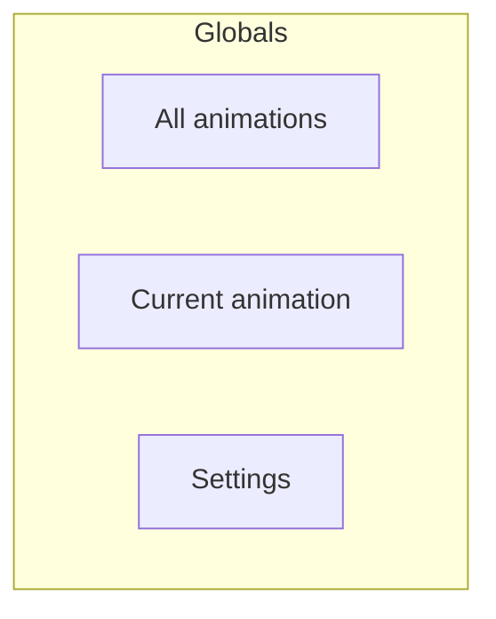
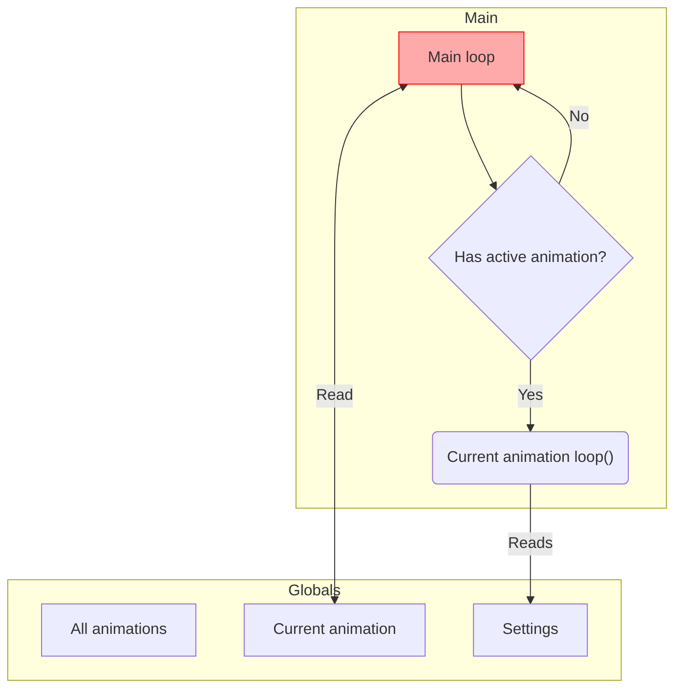
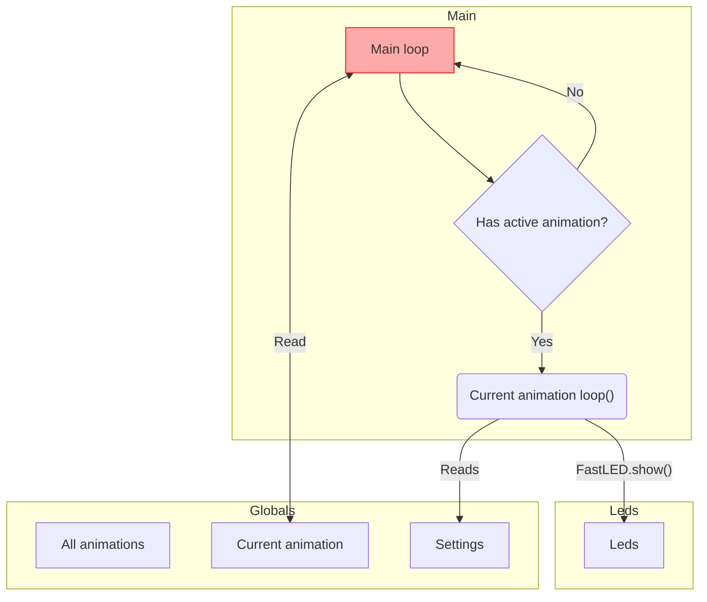
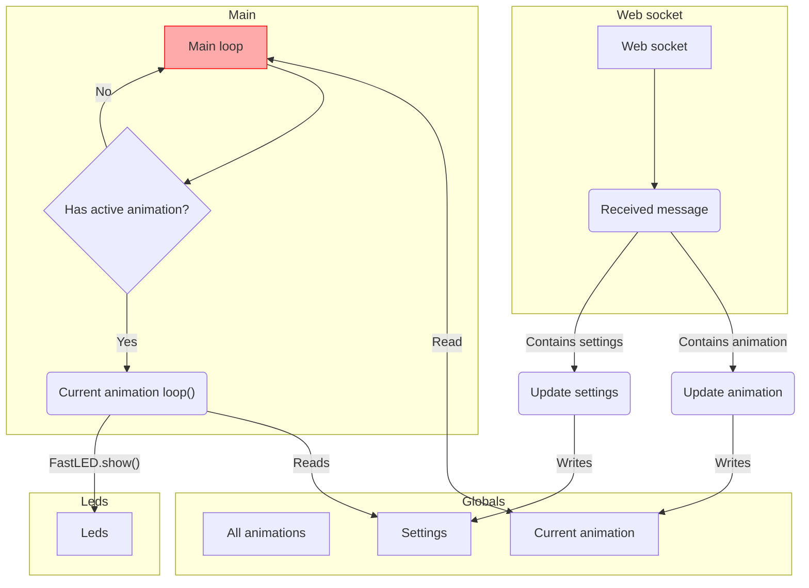
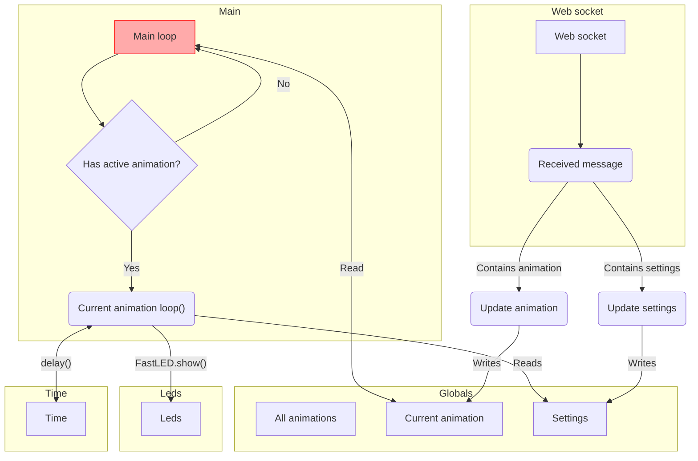
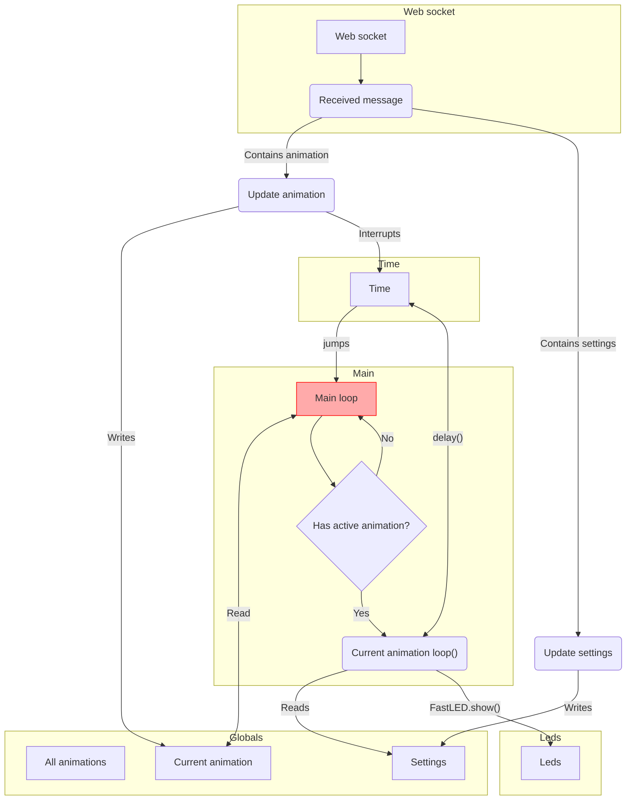

# PowerBar

The PowerBar system consists of several moving parts:

- Globals
- Main loop
- Leds
- Web socket handling
- Time

## Globals

The globals consists of 3 things: all animations, the current animation, and settings. All animations is an array that contains all animations, which are all ready to start. The current animation is a pointer to one of those animations. The settings is a struct containing things like speed, duration, colors etc. Those settings are used by the animations.

## Main loop

The main loop does one thing: if there is a current animation, and is active, the `loop()` method will be called every loop. The active animation reads from the current global settings, so it can respond to setting changes while active.

## Leds

If the active animation wants to output to the leds, it can invoke `FastLED.show()`:

## Web socket handling

Before running the main loop, the main setup setups the Web socket handling which responds to incoming web socket messages. These messages can either update the global settings, or change the current animation:

## Time

If the animation needs to invoke `delay()` to time certain effects, the animation can call `delay()`.

Because `delay()` does not give control back to the main loop until the delay finished, this can make switching animations be very delayed. This is resolved by interrupting any running `delay()` when the web socket receives a new message, and have that `delay()` jump back to the main loop. This avoids running remaining instructions in the `loop()` of the animation that is being stopped.

