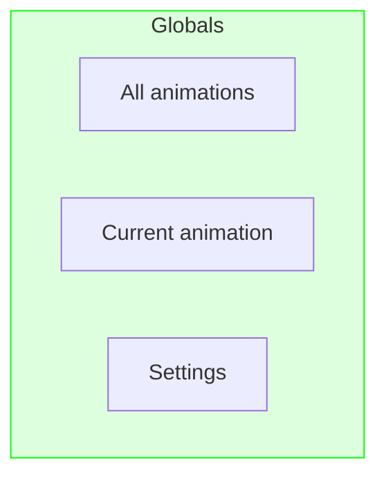
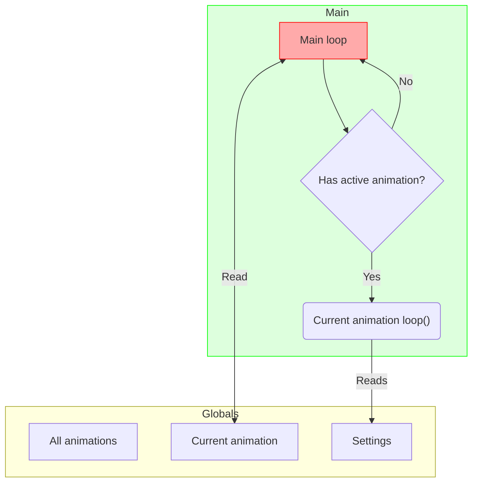
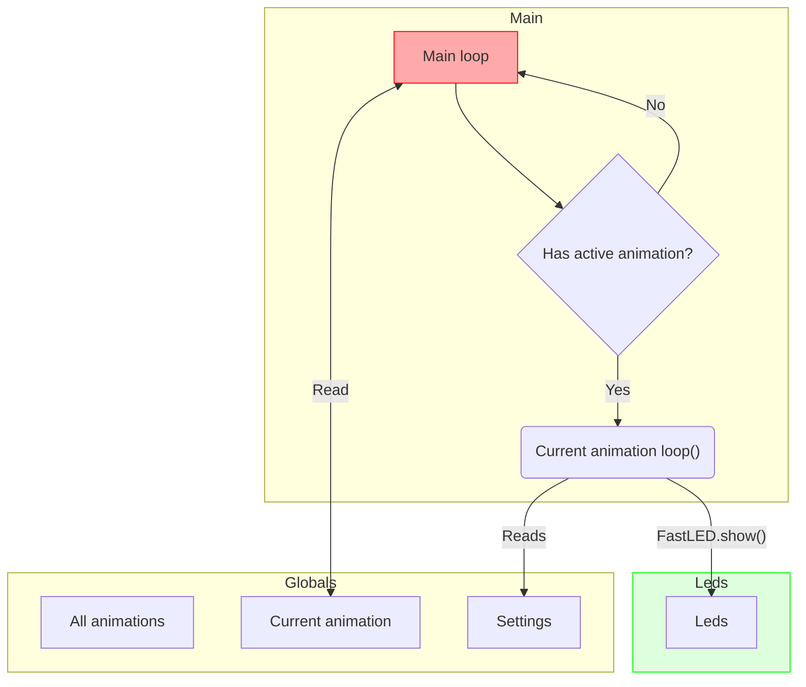
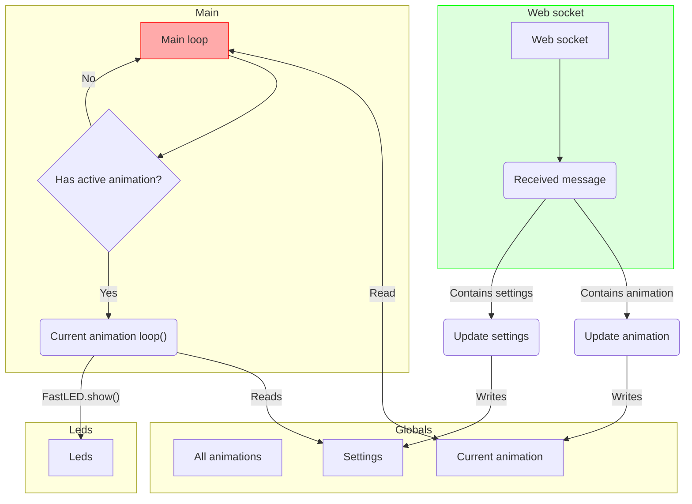
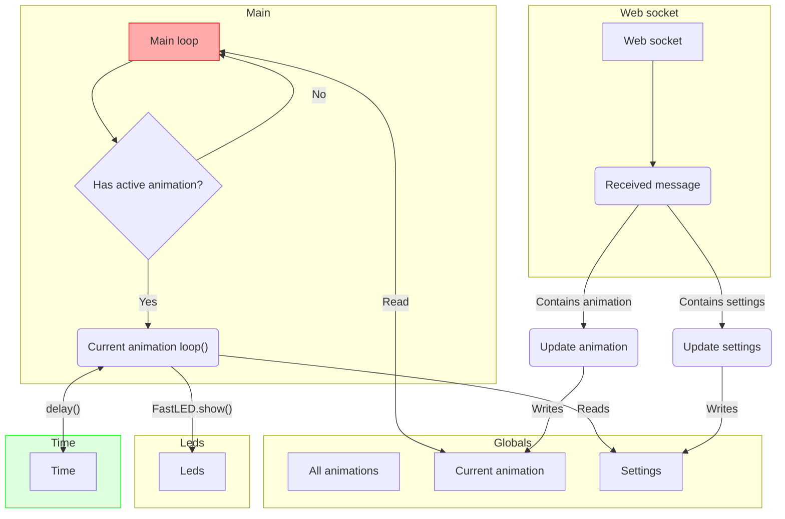
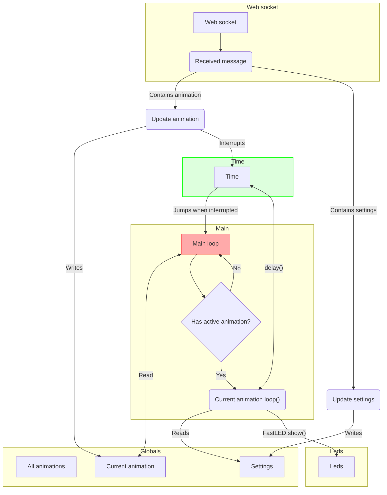

# PowerBar

The PowerBar system consists of several moving parts:

- Globals
- Main loop
- Leds
- Web socket handling
- Time

## Globals

The globals consists of 3 things: all animations, the current animation, and settings. All animations is 
an array that contains all animations, which are all initialized and ready to start. The current animation 
is a pointer to one of those animations. The settings is a struct containing things like speed, duration, 
colors etc. Those settings are used by the animations.



## Main loop

The main loop does one thing: if there is a current animation, and is active, the `loop()` method of the current 
animation will be called every loop. The active animation reads from the current global settings, so it can 
respond to setting changes while being active.

The main loop also checks if the current animation is still active, as some animations can stop on their own. 
If the animation is no longer active, the current animation pointer is set to `nullptr`. This is not shown in 
the graph.



## Leds

If the current animation wants to output new instructions to the leds, it can do so by invoking `FastLED.show()`:



## Web socket handling

Before the main loop is active, the main setup setups the Web socket handling which responds to incoming web 
socket messages and sends back the current state of the system. These incoming messages can either update
the global settings, or change the current animation:




An update in settings simply writes the new value in to the correct property of the global settings. 

An animation change triggers the `stop()` method to be called on the current animation, and the current 
animation pointer is updated to the requested animation, and `start()` is invoked on the new current animation. 
The next time the main loop run it invokes `loop()` on the new current animation, and does not touch the old
animation anymore.

## Time

### `every()`

Animations should try to return from their `loop()` method every rendered frame. This allows the main loop to 
coordinate the animations and stop any running animation. The method `every()` is available that returns true 
once every interval. `every(40)` returns true 25 times per second, spaced equally 40ms apart. A loop implemented as

```c++
void loop() {
    if (every(40))
    {
        step();
    }
}
```

will invoke `step()` every 40ms, progressing the animation at 25 steps ('frames') per second. As this `loop()`
does not use an endless loop with `delay(40)`, other processes, like WebSocket bookkeeping or outbound message
processing get CPU-time too

### `delay()`

If the animation really needs to invoke `delay()` to time certain effects, or orchestrate certain effects 
that are difficult to implement otherwise, the animation can call `delay()`.



Because `delay()` does not give control back to the animation loop until the delay finished, this can cause 
some unwanted delays. If a new animation was requested, but the current animation is still performing some 
lengthy delays, the actual switch can take some time.

This is resolved by interrupting any running `delay()` when the web socket receives a new message, and have 
that `delay()` jump back to the main loop. This avoids running remaining instructions in the `loop()` of the 
animation that is stopped. When `delay()` is interrupted, it does not return to `loop()`, but it jumps to 
main loop. This even works if the animations `loop()` never returns, like for example, a
`do { .. } while(true);` loop.


